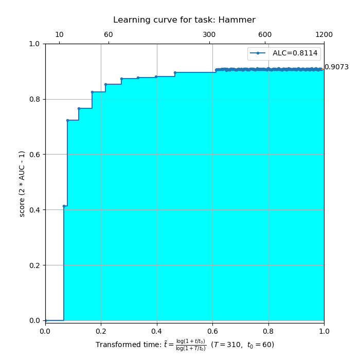
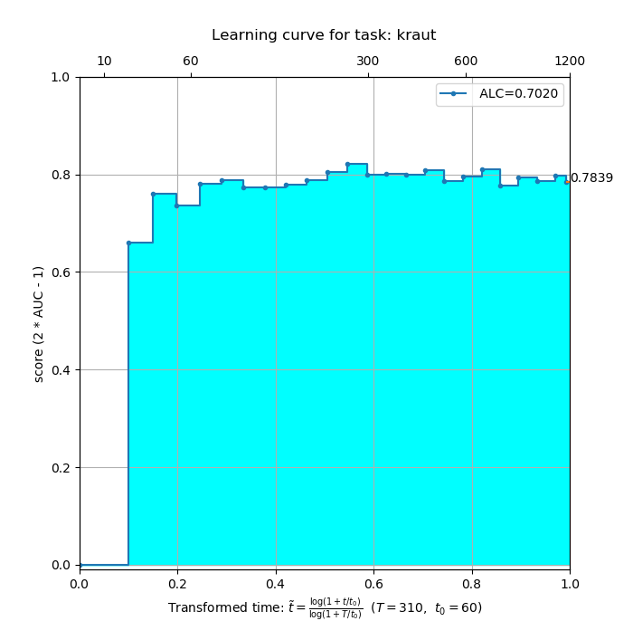
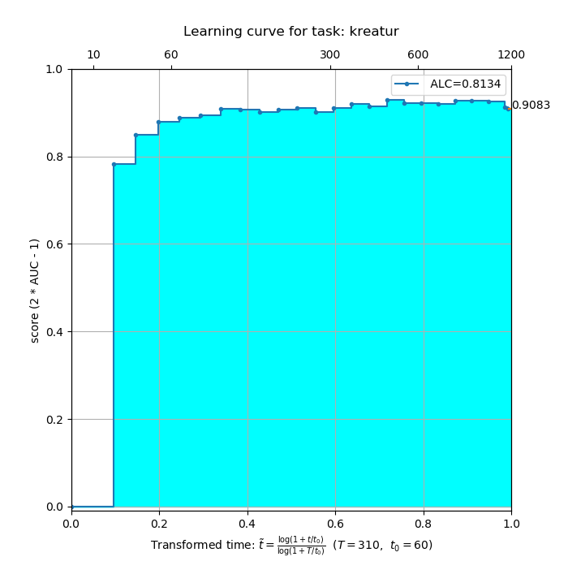
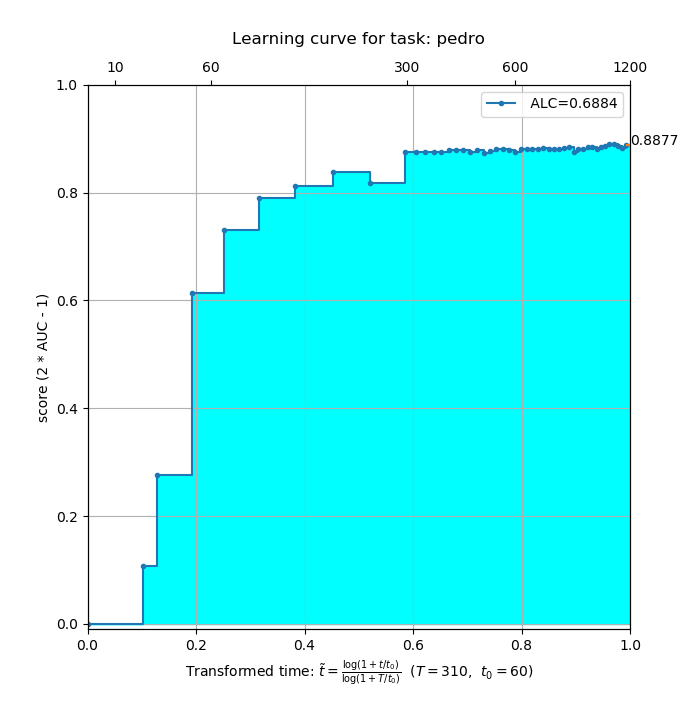
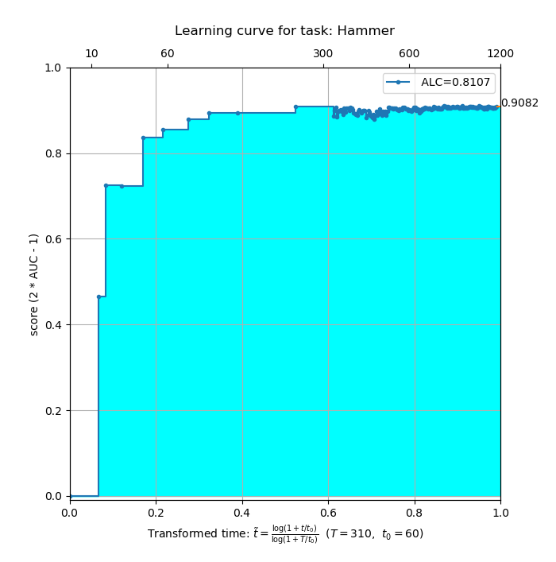
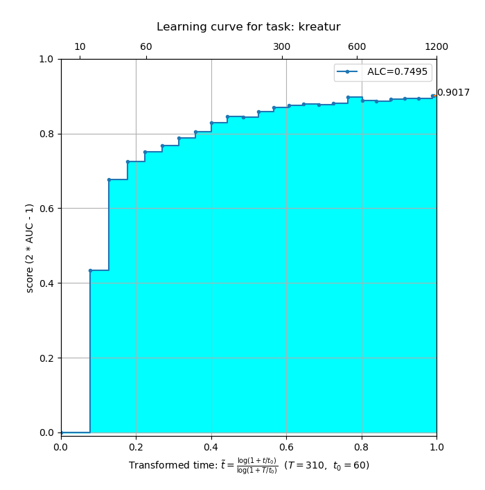

# AutoDLComp19
[AutoDL Competition 2019](https://autodl.chalearn.org/)<br />
The starting kit is available [here](https://github.com/zhengying-liu/autodl_starting_kit_stable).


## Benchmark Results

| |Hammer|Kraut|Kreatur|Pedro|Ucf101|
|-|------|-----|-------|-----|------|
|Yours|[](competition/AutoDL_scoring_output/bench_Hammer/learning-curve-Hammer.png)|[](competition/AutoDL_scoring_output/bench_Kraut/learning-curve-kraut.png)|[](competition/AutoDL_scoring_output/bench_Kreatur/learning-curve-kreatur.png)|[](competition/AutoDL_scoring_output/bench_Pedro/learning-curve-pedro.png)|[](competition/AutoDL_scoring_output/bench_Ucf101/learning-curve-Ucf-101.png)|
|Score||||||
|Current|[](docs/baseline/bench_Hammer/learning-curve-Hammer.png)|[](docs/baseline/bench_Kraut/learning-curve-kraut.png)|[](docs/baseline/bench_Kreatur/learning-curve-kreatur.png)|[](docs/baseline/bench_Pedro/learning-curve-pedro.png)|[](docs/baseline/bench_Ucf101/learning-curve-Ucf-101.png)|
|Score||||||
|Previous|[](docs/old_baseline/bench_Hammer/learning-curve-Hammer.png)|[](docs/old_baseline/bench_Kraut/learning-curve-kraut.png)|[](docs/old_baseline/bench_Kreatur/learning-curve-kreatur.png)|[](docs/old_baseline/bench_Pedro/learning-curve-pedro.png)|[](docs/old_baseline/bench_Ucf101/learning-curve-Ucf-101.png)|
|Score||||||

## Running the benchmark
First you need to make sure that you have the needed dataset in the [competition/AutoDL_public_data](competition/AutoDL_public_data) folder by either mounting or copying them there. Then, to run the benchmark, simply execute [run_benchmark.py](src/run_benchmark.py).
```shell
>>> python pack_submission.py
```
If your IDE supports previewing of the this README, "Yours" will show the results of the last run benchmark.


## Overview
```
├── bohb_logs                              <<  Bohb Log Foler
|
├── competition                            <<  Competition source code for local test
|   |                                          
│   ├── AutoDL_ingestion_program                <<  Main execution library
|   |                                          
│   ├── AutoDL_public_data                      <<  This is where you could put the datasets
|   |                                               (to which I mount the tfdatasets to)
|   |                                          
│   ├── AutoDL_sample_result_submission         <<  General output dir
│   |
│   ├── AutoDL_scoring_output                   <<  Scoring output dir
|   |                                          
│   ├── AutoDL_scoring_program                  <<  Source code to produce AUL score
|   |                                          
│   └── run_local_test.py                       <<  Execute competition evaluation locally
|                                                   which call the ingestion and scoring program
│
├── src                                    <<  Source code
|   |
│   ├── torchhome                          <<  The following structure results from using torch.hub
|   |   |                                      to load and list all available models and use a unified
|   |   |                                      model directory API
|   |   |
|   |   ├── checkpoints                    <<  This is where you should put the pretraind model files
|   |   |                                      see it's readme for the download link
|   |   |                                      (to which I mount my local pretrain models folder)     
|   |   |
|   │   └── hub                            <<  This is where the models' implementation are.
|   |                                          torch.hub is able to load available model implementations
|   |                                          from a github repo, provided it implements the hubconf.py
|   |                                          It downloads the repo and keeps it in a folder with
|   |                                          the name 'owner_reponame_branch'
|   │  
│   ├── bohb_auc.py                        <<  Run bohb on the competition pipeline
|   |                                          
│   ├── config.hjson                       <<  Execution parameters for model.py
|   |                                          
│   ├── pack_submission.py                 <<  Creates a submission.zip according to config.hjson
|   |                                          
│   ├── model.py                           <<  Main file for competition submission
|   |                                          and splits the execution pipeline into:
|   |                                          selection-> transformation-> trainint -> testing
|   |                                          so this should change the least
|   |                                          
│   ├── selection.py                       <<  This module handles model, optimizer, loss function
|   |                                          and lr-scheduler selection
|   |                                          
│   ├── testing.py                         <<  This module handles making predictions
|   |                                          (maybe do custom freezing during testing?)
|   |                                          
│   ├── torch_adapter.py                   <<  Custom Dataset class to wrap tfdatasets for pytorch
|   |                                          
│   ├── training.py                        <<  This module handles training the model
|   |                                          and is where different training schemes are defined
|   |                                          
│   ├── transformations.py                 <<  This module handles adding transformations
|   |                                          to the dataset or extends the model
|   |                                          
│   └── utils.py                           <<  Utility code providing BASEDIR, LOGGER, DEVICE
│
├── submission/                            <<  Folder where the pack_submission.py will put the zips
│
└── utils/                                 <<  General purpose scripts (formating, setup, ..)
```

## General idea
The [model.py](src/model.py) should not really be touched and implements only basic functionality which should not need to be changed.
To customize the behaviour it loads functions from the [selection.py](src/selection.py), [transformations.py](src/transformations.py), [training.py](src/training.py) and [testing.py](src/testing.py) which are executed in said order. Which function of a module is used, can be defined in the [config.hjson](src/config.hjson) as well as additional parameters besides what the model.py already passes on. This makes changing the pipeline straight forward, plug-and-play and reduces the risk of introducing errors when comparing two competing implementations.

## Running a local test
To run a local test [run_local_test.py](competition/run_local_test.py) can be used as described in the starting-kit's readme. Though it has been slightly changed to accept a subfolder name it will use so multiple runs don't erase each other (prev. behaviour).
```
>>> python run_local_test.py --dataset_dir=/some/path/to/a/tfrecord/dataset --code_dir=/home/saitama/AutoDLComp19/src
--score_subdir=whateverfloatsyourgoat --time_budget=300
```
Behind the scenes this script calls the [ingestion](competition/AutoDL_ingestion_program/ingestion.py) and [scoring](competition/AutoDL_scoring_program/score.py) program.

## Packing a submission
To create a submission from the current src folder simply execute [pack_submission.py](src/pack_submission.py).
```
>>> python pack_submission.py --submission_dir=/path/where/I/hide/all/my/failed/submissions --code_dir=/home/saitama/AutoDLComp19/src --out_file=pleasedontfail
>>> *ommiting a list of files added to the zip*
>>> ...
>>> Finished zipping. File has been created at /path/where/I/hide/all/my/failed/submissions/pleasedontfail.zip
and is 7.18 MB in size.
```
If no parameter are given
```
--code_dir        defaults to 'the script's folder'
--submission_dir  defaults to 'the script's parentfolder'/submissions
--out_file        defaults to 'last 20 character of the branchname' + 'last commit hash' + '.zip'
```
If the resulting submission exceeds the 300 MB limit a warning will be printed
